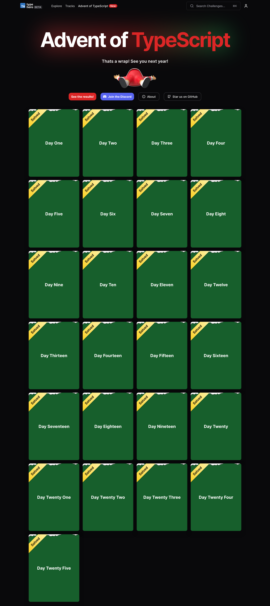

# Advent of TypeScript 2023

[Advent of TypeScript](https://typehero.dev/aot-2023) is a series of progressively more difficult TypeScript challenges, which need to be solved *entirely within the type system*.

You can play [Rock, Paper, Scissors in day 17](https://github.com/frontendlane/advent-of-typescript-2023/blob/main/17.ts), write [ASCII art in day 20](https://github.com/frontendlane/advent-of-typescript-2023/blob/main/20.ts), play [Tic-Tac-Toe in day 21](https://github.com/frontendlane/advent-of-typescript-2023/blob/main/21.ts), and play [Connect 4 in day 23](https://github.com/frontendlane/advent-of-typescript-2023/blob/main/23.ts).

These are my solutions to the December 2023 challenges.

| Day         | Title                                | GitHub link                                                               | TS playground link                              |
|-------------|--------------------------------------|---------------------------------------------------------------------------|-------------------------------------------------|
| December 1  | Christmas Cookies                    | https://github.com/frontendlane/advent-of-typescript-2023/blob/main/1.ts  | https://tsplay.dev/advent-of-typescript-2023-1  |
| December 2  | Christmas Cookie Inventory           | https://github.com/frontendlane/advent-of-typescript-2023/blob/main/2.ts  | https://tsplay.dev/advent-of-typescript-2023-2  |
| December 3  | The Gift Wrapper                     | https://github.com/frontendlane/advent-of-typescript-2023/blob/main/3.ts  | https://tsplay.dev/advent-of-typescript-2023-3  |
| December 4  | Christmas Present Delivery Addresses | https://github.com/frontendlane/advent-of-typescript-2023/blob/main/4.ts  | https://tsplay.dev/advent-of-typescript-2023-4  |
| December 5  | Organize Santa's List                | https://github.com/frontendlane/advent-of-typescript-2023/blob/main/5.ts  | https://tsplay.dev/advent-of-typescript-2023-5  |
| December 6  | Filtering The Children (part 1)      | https://github.com/frontendlane/advent-of-typescript-2023/blob/main/6.ts  | https://tsplay.dev/advent-of-typescript-2023-6  |
| December 7  | Filtering The Children (part 2)      | https://github.com/frontendlane/advent-of-typescript-2023/blob/main/7.ts  | https://tsplay.dev/advent-of-typescript-2023-7  |
| December 8  | Filtering The Children (part 3)      | https://github.com/frontendlane/advent-of-typescript-2023/blob/main/8.ts  | https://tsplay.dev/advent-of-typescript-2023-8  |
| December 9  | Is Santa Dyslexic?                   | https://github.com/frontendlane/advent-of-typescript-2023/blob/main/9.ts  | https://tsplay.dev/advent-of-typescript-2023-9  |
| December 10 | Christmas Street Suffix Tester       | https://github.com/frontendlane/advent-of-typescript-2023/blob/main/10.ts | https://tsplay.dev/advent-of-typescript-2023-10 |
| December 11 | Protect the List                     | https://github.com/frontendlane/advent-of-typescript-2023/blob/main/11.ts | https://tsplay.dev/advent-of-typescript-2023-11 |
| December 12 | Find Santa                           | https://github.com/frontendlane/advent-of-typescript-2023/blob/main/12.ts | https://tsplay.dev/advent-of-typescript-2023-12 |
| December 13 | Count the Days                       | https://github.com/frontendlane/advent-of-typescript-2023/blob/main/13.ts | https://tsplay.dev/advent-of-typescript-2023-13 |
| December 14 | Naughty List Decipher                | https://github.com/frontendlane/advent-of-typescript-2023/blob/main/14.ts | https://tsplay.dev/advent-of-typescript-2023-14 |
| December 15 | Box The Toys!                        | https://github.com/frontendlane/advent-of-typescript-2023/blob/main/15.ts | https://tsplay.dev/advent-of-typescript-2023-15 |
| December 16 | Find Santa (part 2)                  | https://github.com/frontendlane/advent-of-typescript-2023/blob/main/16.ts | https://tsplay.dev/advent-of-typescript-2023-16 |
| December 17 | Rock, Paper, Scissors                | https://github.com/frontendlane/advent-of-typescript-2023/blob/main/17.ts | https://tsplay.dev/advent-of-typescript-2023-17 |
| December 18 | Santa's Remaining Deliveries         | https://github.com/frontendlane/advent-of-typescript-2023/blob/main/18.ts | https://tsplay.dev/advent-of-typescript-2023-18 |
| December 19 | Help Santa Embezzle Funds            | https://github.com/frontendlane/advent-of-typescript-2023/blob/main/19.ts | https://tsplay.dev/advent-of-typescript-2023-19 |
| December 20 | TypeScript ASCII Art!                | https://github.com/frontendlane/advent-of-typescript-2023/blob/main/20.ts | https://tsplay.dev/advent-of-typescript-2023-20 |
| December 21 | What is Tic Tac Toe?                 | https://github.com/frontendlane/advent-of-typescript-2023/blob/main/21.ts | https://tsplay.dev/advent-of-typescript-2023-21 |
| December 22 | Reindeer Sudoku                      | https://github.com/frontendlane/advent-of-typescript-2023/blob/main/22.ts | https://tsplay.dev/advent-of-typescript-2023-22 |
| December 23 | Connect 4, but in TypeScript types   | https://github.com/frontendlane/advent-of-typescript-2023/blob/main/23.ts | https://tsplay.dev/advent-of-typescript-2023-23 |
| December 24 | Santa is stuck!                      | https://github.com/frontendlane/advent-of-typescript-2023/blob/main/24.ts | https://tsplay.dev/advent-of-typescript-2023-24 |

